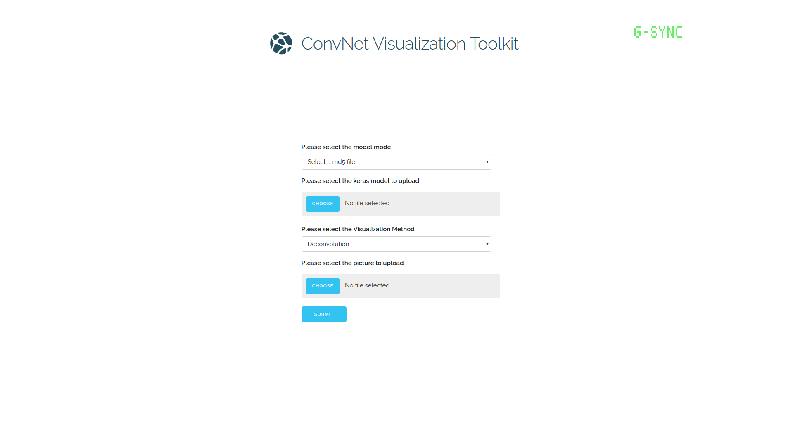

# CNN Visualization Toolkit

Visualize your CNNs with deconvolution nets proposed by Zeiler & Fergus (2014), activation based method proposed by Erhan et al.(2009) and t-SNE.

## Screenshots



## Setup

To install dependancies,
```
pip2 install -r requirements.txt
```
## Run

To run the program on command line,
```
cd src
python2 index.py
```

To start the flask server,
```
cd src
python2 server.py
```